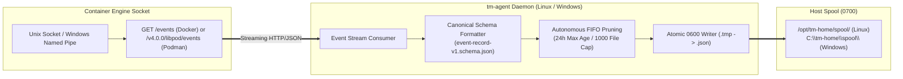

# 📦 tm-agent — Unified Cross-Platform Event Collector Daemon

[](https://go.dev)
[](README.md)
[](LICENSE)
[](CONFIG)

`tm-agent` is a standalone, lightweight, cross-platform **Event Collector Daemon** written in Go. It consumes real-time container lifecycle events directly from the **Container Engine Socket API** (Podman / Docker) and atomically emits schema-compliant JSON evidence records into a persistent host spool directory.

It fulfills **TASK-TM-028 (TN-013)** and adheres to architectural standards defined in [TM-ADR-0027](file:///home/eddywiyatno/git/devops-handbook/docs/adr/tomcat-monitoring/adr-records/TM-ADR-0027.md) and [TM-ADR-0008](file:///home/eddywiyatno/git/devops-handbook/docs/adr/tomcat-monitoring/adr-records/TM-ADR-0008.md).

---

## 📑 Table of Contents

- [🏛️ Architecture & Stream Pipeline](#️-architecture--stream-pipeline)
- [🚀 Key Capabilities](#-key-capabilities)
- [📦 CLI Usage & Flags](#-cli-usage--flags)
- [🛠️ Build & Validation](#️-build--validation)
- [📂 Repository Structure](#-repository-structure)
- [📄 License, Ownership & Disclaimer](#-license-ownership--disclaimer)

---

## 🏛️ Architecture & Stream Pipeline



---

## 🚀 Key Capabilities

- **Zero External Runtime Dependencies:** Compiled as a single static binary (`CGO_ENABLED=0`) with zero external C-library or interpreter requirements.
- **Direct Engine Socket Streaming:** Connects natively to Docker (`GET /events`) or Podman (`GET /v4.0.0/libpod/events`) via Unix Domain Sockets (`/run/user/1000/podman/podman.sock`, `/var/run/docker.sock`), Windows Named Pipes (`\\.\pipe\docker_engine`), or TCP mTLS.
- **Strict Schema Contract:** Emits `container_state`, `runtime_oom`, and `collector_status` records conforming to [`event-record-v1.schema.json`](../tomcat-diagnostic-event-collector/config/schemas/event-record-v1.schema.json).
- **Atomic File Serialization:** Writes records with `0600` permissions (`-rw-------`) to temporary files before executing an atomic rename (`.tmp` $\rightarrow$ `.json`) to eliminate read race conditions.
- **Autonomous FIFO Spool Retention:**
  - Auto-prunes `.json` records older than 24 hours.
  - Removes orphaned `.tmp` files older than 60 minutes.
  - Enforces a maximum capacity of 1,000 files via FIFO eviction.
- **Multi-OS Native Execution:** Runs as a systemd user daemon on Linux or a background service/console runner on Windows Server.

---

## 📦 CLI Usage & Flags

```bash
# Run agent in foreground (streaming container events)
tm-agent

# Capture a one-shot container status snapshot and exit immediately
tm-agent --run-once

# Specify target container and persistent spool directory explicitly
tm-agent --target tomcat-jmx-exporter --target-id lab/tomcat-01/default --spool-dir /opt/tm-home/spool

# Specify custom container engine and socket path
tm-agent --engine podman --socket /run/user/1000/podman/podman.sock

# Display version information
tm-agent --version
```

---

## 🛠️ Build & Validation

```bash
# Build native binary
make build

# Cross-compile full matrix (Linux amd64, Linux arm64, Windows amd64)
make build-all

# Execute Go unit test suite
make test

# Validate repository layout and governance rules
make validate
```

---

## 📂 Repository Structure

```text
tm-agent/
├── AGENTS.md                  Agent governance and coding rules
├── CONFIG                     Metadata and default operational thresholds
├── CONFIG.example             Enterprise configuration template
├── LICENSE                    Apache License 2.0
├── Makefile                   Build, cross-compilation, and test automation
├── PROJECT                    Script-readable project identifier
├── README.md                  Technical documentation
├── VERSION                    Release version
├── cmd/
│   └── tm-agent/              Main CLI entrypoint
├── internal/
│   ├── config/                Configuration parser
│   ├── engine/                Socket stream consumer & Docker/Podman adapters
│   ├── spool/                 Atomic writer and FIFO retention manager
│   └── validator/             Schema validator
├── systemd/                   Systemd service unit definitions
└── pkg/                       Shared utility packages
```

---

## 📄 License, Ownership & Disclaimer

### 👤 Author & Ownership
This repository, along with its associated architectures, automation components, and codebases, is designed, authored, and maintained by **Eddy Wiyatno** ([@edkas07-oss](https://github.com/edkas07-oss)).

### ⚖️ License
This project is licensed under the [Apache License 2.0](LICENSE) - see the [LICENSE](LICENSE) file for complete terms and conditions.

### 🛡️ Research & Development Disclaimer
> [!NOTE]
> All research, development, architectural design, prototyping, test fixtures, and validation suites in this repository were conducted and verified exclusively within **independent, personal laboratory environments** using personal hardware, network infrastructure, and self-hosted tooling. No confidential corporate assets, proprietary production data, or third-party enterprise infrastructure were utilized in the creation or publication of this project.
