# 📦 tm-agent — Unified Cross-Platform Event Collector Daemon

[](https://go.dev)
[](README.md)
[](LICENSE)
[](CONFIG)

`tm-agent` (*Tomcat Monitoring Event Collector Daemon*) is a standalone, lightweight, cross-platform background daemon written in Go. It consumes real-time container lifecycle streaming events directly from the **Container Engine Socket API** (Podman and Docker) and atomically emits schema-compliant JSON evidence records into a persistent host spool directory, eliminating reliance on legacy, brittle Bash collector daemons.

---

## 📑 Table of Contents

- [💡 Why tm-agent? (Motivation & Design Rationale)](#-why-tm-agent-motivation--design-rationale)
- [🏛️ Architecture & Stream Pipeline](#️-architecture--stream-pipeline)
- [🚀 Installation & Compilation](#-installation--compilation)
- [📦 CLI Usage & Operational Modes](#-cli-usage--operational-modes)
- [🧪 Validation & Multi-OS Test Results](#-validation--multi-os-test-results)
- [📂 Repository Structure](#-repository-structure)
- [📄 License, Ownership & Disclaimer](#-license-ownership--disclaimer)

---

## 💡 Why `tm-agent`? (Motivation & Design Rationale)

In autonomous observability and container incident response pipelines, capturing ephemeral failure states (*OOM killed*, *exit codes*, *abrupt process deaths*) requires continuous, resilient event collection. Relying on legacy Bash collector scripts (`src/collector.sh`) or raw shell loops introduces severe operational liabilities:

1. **Linux vs. Windows Discrepancy:** Shell-based collector daemons relying on Linux `systemd --user` units and subshells fail completely on Windows Server environments.
2. **Subshell & Buffering Lags:** Running subshell pipelines like `podman events | while read ...` suffers from stdout pipe buffering, high CPU overhead, and unhandled subshell crash disconnects.
3. **Race Conditions on Evidence Consumption:** Concurrently writing files in shell while the AI Diagnostic Service reads them leads to partial-read race conditions and corrupted JSON parses.
4. **Unbounded Spool Growth:** Shell scripts lack robust FIFO quota enforcement, risking filesystem exhaustion under high incident volumes.

`tm-agent` resolves these challenges by connecting directly to the **Container Engine Socket API** via persistent HTTP chunked streaming, performing two-phase atomic serialization (`0600`), and enforcing autonomous FIFO retention.

### 📊 Feature & Approach Comparison Matrix

| Operational Capability | Raw `podman/docker events` CLI | Legacy Shell Daemon (`src/collector.sh`) | **`tm-agent` (Go Daemon)** |
| :--- | :--- | :--- | :--- |
| **Windows Native Execution** | Requires manual PowerShell loop | Fails (requires Linux/Bash runtime) | **Single native static binary (`tm-agent.exe`)** |
| **Socket Stream Protocol** | Unstructured CLI stdout | Brittle string scraping in subshell | **Persistent HTTP chunked socket streaming** |
| **Connection Resiliency** | Exits on engine disconnect | Unhandled background death | **Automatic exponential backoff reconnect** |
| **Atomic File Serialization** | Direct file redirection (`>`) | Race-prone non-atomic writes | **Thread-safe `.tmp` $\rightarrow$ `.json` (`0600`)** |
| **Schema Contract Guarantee** | None | Ad-hoc text templating | **100% strict `event-record-v1` validation** |
| **Autonomous Retention** | Not supported | External cron needed | **Built-in 24h prune & 1,000 FIFO cap** |
| **Runtime Dependencies** | Engine CLI installed | Requires Bash, Coreutils, jq | **Zero external dependencies (`CGO_ENABLED=0`)** |

---

## 🏛️ Architecture & Stream Pipeline

`tm-agent` runs continuously in the background, listening for container lifecycle events and streaming evidence directly into the persistent spool directory:

```mermaid
flowchart LR
    subgraph ENGINE["1. Container Engine Socket"]
        direction LR
        SOCK["Unix Socket / Named Pipe / TCP"] --> STREAM["GET /events Stream"]
    end

    subgraph AGENT["2. tm-agent Stream Pipeline"]
        direction LR
        LISTENER["Stream Consumer"] --> FORMATTER["Schema Formatter"] --> PRUNER["FIFO Pruner"] --> WRITER["Atomic Writer (0600)"]
    end

    subgraph SPOOL["3. Host Spool (0700)"]
        SPOOL_DIR["/opt/tm-home/spool (Linux)<br/>C:/tm-home/spool (Windows)"]
    end

    subgraph CONSUMER["4. AI Diagnostics"]
        DS["Tomcat Diagnostic Service"]
    end

    STREAM ==>|HTTP/JSON Stream| LISTENER
    WRITER ==>|Atomic .tmp to .json| SPOOL_DIR
    SPOOL_DIR ==>|Read-Only Mount| DS
```



### 🎯 Core Advantages

- **Zero External Runtime Dependencies:** Compiled as a single static binary (`CGO_ENABLED=0`) requiring no external Python, Node.js, or Bash runtimes on the host.
- **Direct Engine Socket Streaming:** Connects natively to Docker (`GET /events`) or Podman (`GET /v4.0.0/libpod/events`) via Unix Domain Sockets (`/run/user/.../podman.sock`, `/var/run/docker.sock`), Windows Named Pipes (`\\.\pipe\docker_engine`), or TCP mTLS.
- **Strict Schema Contract:** Emits `container_state`, `runtime_oom`, and `collector_status` records conforming to [`event-record-v1.schema.json`](https://github.com/edkas07-oss/tomcat-diagnostic-event-collector/blob/main/config/schemas/event-record-v1.schema.json).
- **Atomic File Serialization:** Writes records with `0600` permissions (`-rw-------`) to temporary files before executing an atomic rename (`.tmp` $\rightarrow$ `.json`) to eliminate read race conditions.
- **Autonomous FIFO Spool Retention:** Auto-prunes `.json` records older than 24 hours, removes orphaned `.tmp` files older than 60 minutes, and enforces a maximum capacity of 1,000 files via FIFO eviction.
- **Native Multi-OS Execution:** Runs as a systemd user daemon on Linux (`systemd --user`) or a background service/console runner on Windows Server.

---

## 🚀 Installation & Compilation

For complete build prerequisites, cross-compilation matrix details, systemd daemon registration, and Windows background service configuration, please refer to the dedicated [**`INSTALL.md`**](INSTALL.md) guide.

```bash
# Quick build and installation to ~/.local/bin
make install
```

---

## 📦 CLI Usage & Operational Modes

### 1. Foreground Streaming Daemon

```bash
# Run agent in foreground with default settings
tm-agent

# Specify target container and custom spool directory
tm-agent --target tomcat-jmx-exporter --target-id lab/tomcat-01/default --spool-dir /opt/tm-home/spool

# Override container engine and socket path
tm-agent --engine podman --socket /run/user/1000/podman/podman.sock
```

### 2. One-Shot Snapshot Mode

```bash
# Capture an immediate container status snapshot and exit
tm-agent --run-once --spool-dir /opt/tm-home/spool
```

### 3. Linux Systemd User Daemon Setup

```bash
# Copy systemd service unit template
mkdir -p ~/.config/systemd/user
cp systemd/tm-agent.service ~/.config/systemd/user/

# Reload and start service
systemctl --user daemon-reload
systemctl --user enable --now tm-agent.service

# Check service logs
journalctl --user -u tm-agent.service -f
```

### 4. Windows Service & Background Execution

```powershell
# Run interactively via PowerShell
.\bin\windows_amd64\tm-agent.exe --spool-dir C:\tm-home\spool

# Query version
.\bin\windows_amd64\tm-agent.exe --version
```

---

## 🧪 Validation & Multi-OS Test Results

`tm-agent` undergoes rigorous automated testing across local development workstations, CI runners, and live multi-OS production hosts (*Linux and Windows Server*).

### 📊 Cross-Compilation Matrix

All binaries are compiled statically with zero external shared library dependencies:

| Target OS | Target Architecture | Output Binary | Size | Test Status |
| :--- | :--- | :--- | :---: | :---: |
| **Linux** | `amd64` (x86_64) | `bin/linux_amd64/tm-agent` | 6.1 MB | **100% Passed (Ubuntu / Debian / RHEL / Amazon Linux)** |
| **Linux** | `arm64` (AArch64) | `bin/linux_arm64/tm-agent` | 5.6 MB | **100% Compiled & Verified (AWS Graviton)** |
| **Windows** | `amd64` (x86_64) | `bin/windows_amd64/tm-agent.exe` | 6.4 MB | **100% Passed (Windows Server 2019 AWS EC2)** |

---

### 1. Go Unit Test Suite Results

Test suite covers all core internal packages (`collector`, `config`, `engine`, `schema`, `spool`, `validator`):

```text
=== RUN   TestCollectorRecordSnapshotRunningContainer
--- PASS: TestCollectorRecordSnapshotRunningContainer (0.00s)
=== RUN   TestCollectorRecordSnapshotNotFoundContainer
--- PASS: TestCollectorRecordSnapshotNotFoundContainer (0.00s)
=== RUN   TestCollectorRecordSnapshotEngineError
--- PASS: TestCollectorRecordSnapshotEngineError (0.00s)
=== RUN   TestCollectorRunOnce
--- PASS: TestCollectorRunOnce (0.00s)
=== RUN   TestNewDefaultConfig
--- PASS: TestNewDefaultConfig (0.00s)
=== RUN   TestLoadConfigFile
--- PASS: TestLoadConfigFile (0.00s)
=== RUN   TestApplyEnvOverrides
--- PASS: TestApplyEnvOverrides (0.00s)
=== RUN   TestEventMessageNormalization
--- PASS: TestEventMessageNormalization (0.00s)
=== RUN   TestStreamingEventParsing
--- PASS: TestStreamingEventParsing (0.00s)
=== RUN   TestValidEventRecords
--- PASS: TestValidEventRecords (0.00s)
=== RUN   TestInvalidEventRecords
--- PASS: TestInvalidEventRecords (0.00s)
=== RUN   TestWriteRecordAtomic
--- PASS: TestWriteRecordAtomic (0.00s)
=== RUN   TestWriteRecordSizeLimit
--- PASS: TestWriteRecordSizeLimit (0.00s)
=== RUN   TestPruneStaleTmpAndJson
--- PASS: TestPruneStaleTmpAndJson (0.00s)
=== RUN   TestPruneFIFOQuota
--- PASS: TestPruneFIFOQuota (0.00s)
=== RUN   TestValidateRepositoryValid
--- PASS: TestValidateRepositoryValid (0.00s)
PASS (ok: collector, config, engine, schema, spool, validator)
```

---

### 2. Live Linux One-Shot Snapshot Test Output (Podman Socket API)

```text
$ ./bin/tm-agent --run-once --spool-dir /tmp/test-agent-spool --target tomcat-jmx-exporter
✔ SUCCESS: Connected to container engine: podman (API: 1.41, OS: linux)
ℹ INFO: Starting tm-agent Event Collector Daemon
ℹ INFO: Target Workload : lab/tomcat-01/default (tomcat-jmx-exporter)
ℹ INFO: Spool Directory : /tmp/test-agent-spool
ℹ INFO: Container Engine: podman (/run/user/1000/podman/podman.sock)
✔ SUCCESS: Initial snapshot recorded (2 evidence files written)
ℹ INFO: One-shot snapshot execution completed successfully

$ ls -la /tmp/test-agent-spool/
drwx------  2 eddywiyatno eddywiyatno  4096 Sep 19 07:52 .
-rw-------  1 eddywiyatno eddywiyatno   264 Sep 19 07:52 1789347140608638731_container_state.json
-rw-------  1 eddywiyatno eddywiyatno   282 Sep 19 07:52 1789347140608775839_runtime_oom.json
```

**Payload `container_state.json`:**
```json
{
  "schema_version": 1,
  "type": "container_state",
  "target_id": "lab/tomcat-01/default",
  "generation": 1,
  "observed_at": "2026-09-19T00:52:20Z",
  "status": "collected",
  "strength": "direct",
  "value": {
    "state": "running"
  },
  "redacted": false
}
```

---

### 3. Local Validation Commands

```bash
# Execute automated Go unit tests
make test

# Execute static repository layout and JSON schema validation
make validate
```

---

## 📂 Repository Structure

```text
tm-agent/
├── AGENTS.md                  Agent governance and coding rules
├── CONFIG                     Metadata and default operational thresholds
├── CONFIG.example             Enterprise configuration template
├── LICENSE                    Apache License 2.0
├── Makefile                   Build, cross-compilation, and test automation
├── PROJECT                    Script-readable project identifier
├── README.md                  Technical documentation
├── VERSION                    Release version
├── cmd/
│   └── tm-agent/              Main CLI entrypoint
├── internal/
│   ├── buildinfo/             Build metadata and git commit stamping
│   ├── collector/             Core daemon orchestrator and snapshot handler
│   ├── config/                Configuration parser and environment resolver
│   ├── engine/                Socket stream consumer & Docker/Podman adapters
│   ├── schema/                Canonical event-record-v1 data contracts
│   ├── service/               Multi-OS daemon & Windows Service runners
│   ├── spool/                 Atomic writer and FIFO retention manager
│   └── validator/             Static repository governance validator
├── pkg/
│   └── termutil/              Terminal formatting and structured loggers
├── scripts/
│   ├── build.sh               Cross-compilation runner
│   ├── test.sh                Unit test execution script
│   └── validate.sh            Static repository validation runner
└── systemd/
    └── tm-agent.service       Template service unit for Linux systemd user daemon
```

---

## 📄 License, Ownership & Disclaimer

### 👤 Author & Ownership
This repository, along with its associated architectures, automation components, and codebases, is designed, authored, and maintained by **Eddy Wiyatno** ([@edkas07-oss](https://github.com/edkas07-oss)).

### ⚖️ License
This project is licensed under the [Apache License 2.0](LICENSE) - see the [LICENSE](LICENSE) file for complete terms and conditions.

### 🛡️ Research & Development Disclaimer
> [!NOTE]
> All research, development, architectural design, prototyping, test fixtures, and validation suites in this repository were conducted and verified exclusively within **independent, personal laboratory environments** using personal hardware, network infrastructure, and self-hosted tooling. No confidential corporate assets, proprietary production data, or third-party enterprise infrastructure were utilized in the creation or publication of this project.
